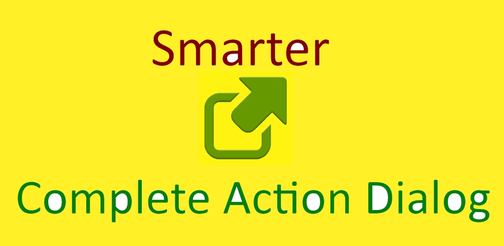

# Better Open With - a better way to open files.

The application is no longer actively developed but I'll happily accept fixes and new features. Feel free to send a PR or [Contact Me](https://www.giorgi.dev/#contact) if you would like to become a maintainer.

Thanks to Reddit's oroboros74, who [came up with the idea](https://www.reddit.com/r/Android/comments/24okaq/what_apps_would_you_like_to_have_that_dont_exist/ch96jid/) for this app!

- [[New App] "Better Open With" Makes Your Complete Action Dialog Smarter](https://www.androidpolice.com/2014/07/29/new-app-better-open-with-makes-your-complete-action-dialog-smarter/)
- [Better Open With Expertly Manages Your Android File Associations](https://lifehacker.com/better-open-with-expertly-manages-your-android-file-as-1619466245)
- [Better Open With Improves Android's App Chooser with Delayed Defaults](https://lifehacker.com/better-open-with-improves-androids-app-chooser-with-del-1612880760)

